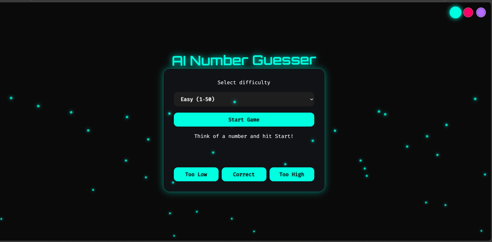
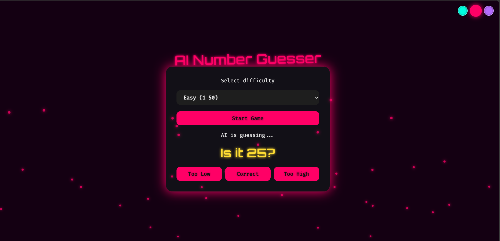
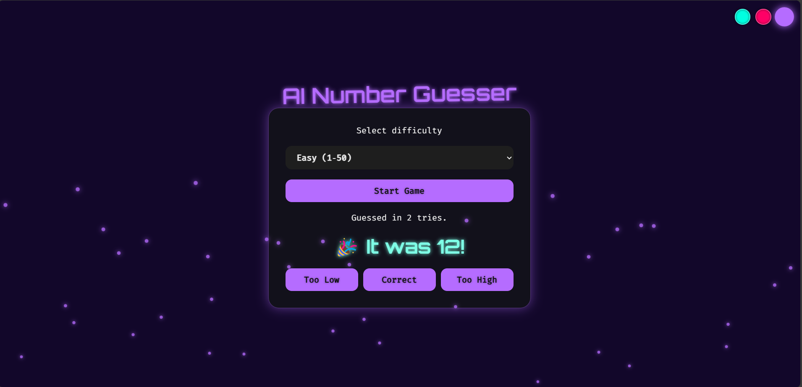

# 🎯 Futuristic AI Number Guesser

The **Futuristic AI Number Guesser** is an intelligent web-based game where players compete against an AI to guess a secret number. The AI uses advanced prediction logic and interactive UI to create a fun, educational, and futuristic experience.

## 🚀 Features

* **🤖 Smart AI Opponent:** Uses probability-based logic (Minimax/Heuristics) to guess efficiently.
* **🎮 Interactive Gameplay:** Engage in a Human vs. AI turn-based battle.
* **🧠 Adaptive Difficulty:** Choose from Beginner, Intermediate, or Expert levels.
* **📊 Live Analytics:** Real-time score tracking and game stats.
* **💻 Modern UI:** Responsive design with smooth animations and transitions.
* **🔮 Helper Tools:** In-game hints, retries, and customizable number ranges.
* **🌙 Futuristic Aesthetics:** Dark mode with neon accents and custom themes.

---

## 🛠️ Technologies Used

| Category | Tech Stack |
| :--- | :--- |
| **Frontend** | HTML5, CSS3, JavaScript (ES6+) |
| **AI Logic** | JavaScript-based Strategy (Binary Search / Heuristics) |
| **UI/UX** | Responsive Flexbox/Grid, CSS Animations |

---

## 🎮 How to Play

1.  **Start Game:** The system generates a hidden secret number within a chosen range (e.g., 1 to 100).
2.  **Take Turns:** You and the AI alternate making guesses.
3.  **Receive Feedback:** After every guess, the interface signals if the number is **"Too High"** or **"Too Low"**.
4.  **Win:** The first entity (Human or AI) to guess the exact number wins the round!

---

## 🧠 AI Behavior

The AI isn't just random; it plays to win!
* **Optimized Logic:** Uses binary search algorithms to narrow down possibilities half as fast as a human might.
* **Learning Mode:** Adjusts behavior based on the selected difficulty level.
* **Pattern Recognition:** Simulates "thinking" time for a realistic opponent feel.

---

## 📸 Screenshots

| Neon Cyan Theme | Neon Red Theme |
| :---: | :---: |
|  |  |

| Violet Theme |
| :---: |
|  |

---

## 📱 Mobile Version

The game is also available as a cross-platform mobile app built with **React Native + Expo**.

### Mobile Features
* 📱 **Futuristic Backgrounds:** Animated particle effects.
* 🎨 **Theme Switching:** Toggle between Cyan, Red, and Purple themes on the fly.
* 🗣️ **Text-to-Speech:** Game announces results using `Expo Speech`.
* 🔊 **Sound Effects:** Beeps and success chimes for immersion.

### ⚙️ How to Run Mobile App

Ensure you have Node.js installed, then run:

```bash
# Install dependencies
npm install

# Start the Expo development server
npx expo start

```
---

## 📄 License

This project is developed for educational purposes.

## 📬 Contact

**Naveen Kumar P** [](https://www.linkedin.com/in/naveenkumarp20/)
